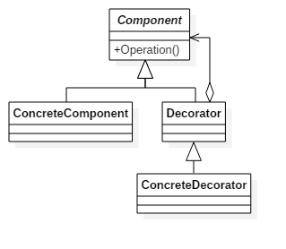

#### 定义

装饰模式可以动态地给一个对象添加一些额外的职责。

#### 类图



**`Component` 抽象构件**

`Component`是一个接口或者是抽象类，就是定义我们最核心的对象，也就是最原始的对象。

**`ConcreteComponent` 具体构件**

`ConcreteComponent`是最核心、最原始、最基本的接口或抽象类的实现。

**`Decorator` 装饰角色**

一般是一个抽象类，实现接口或者抽象方法，且属性里有一个`private`变量指向`Component`抽象构件。

**`ConcreteDecorator` 具体装饰角色**

`ConcreteDecorator`把最核心的、最原始的、最基本的东西装饰成其他东西。

#### 实现

抽象构件：
```java
package com.sigalhu.decoratorpattern.impl;

public abstract class Component {
    //抽象的方法
    public abstract void operate();
}
```
具体构件：
```java
package com.sigalhu.decoratorpattern.impl;

public class ConcreteComponent extends Component {
    //具体实现
    @Override
    public void operate() {
        System.out.println("do something");
    }
}
```
抽象装饰者：
```java
package com.sigalhu.decoratorpattern.impl;

public abstract class Decorator extends Component {
    private Component component = null;

    //通过构造函数传递被装饰者
    public Decorator(Component _component){
        this.component = _component;
    }

    //委托给被修饰者执行
    @Override
    public void operate() {
        this.component.operate();
    }
}
```
具体的装饰类：
```java
package com.sigalhu.decoratorpattern.impl;

public class ConcreteDecorator1 extends Decorator{
    //定义被修饰者
    public ConcreteDecorator1(Component _component){
        super(_component);
    }

    //定义自己的修饰方法
    private void method1(){
        System.out.println("method1 修饰");
    }

    //重写父类的方法
    @Override
    public void operate() {
        this.method1();
        super.operate();
    }
}
```
```java
package com.sigalhu.decoratorpattern.impl;

public class ConcreteDecorator2 extends Decorator {
    //定义被修饰者
    public ConcreteDecorator2(Component _component){
        super(_component);
    }

    //定义自己的修饰方法
    private void method2(){
        System.out.println("method2 修饰");
    }

    //重写父类的方法
    @Override
    public void operate() {
        super.operate();
        this.method2();
    }
}
```
场景类：
```java
package com.sigalhu.decoratorpattern.impl;

public class Client {
    public static void main(String[] args){
        Component component = new ConcreteComponent();
        //第一次修饰
        component = new ConcreteDecorator1(component);
        //第二次修饰
        component = new ConcreteDecorator2(component);
        //修饰后运行
        component.operate();
    }
}
```

#### 优点

* 装饰类和被装饰类可以独立发展，而不会互相耦合；
* 装饰模式作为继承关系的替代方案，可以解决子类膨胀的问题；
* 装饰模式可以动态地扩展一个类的功能。

#### 缺点

多层的装饰比较复杂，因此，尽量减少装饰类的数量，以便降低系统的复杂度。