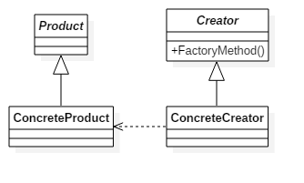

#### 定义

工厂方法模式一般定义一个用于创建对象的接口，让子类决定实例化哪一个类。工厂方法使一个类的实例化延迟到其子类。

#### 类图



在工厂方法模式中，抽象产品类`Product`负责定义产品的共性，实现对事物最抽象的定义；`Creator`为抽象创建类，也就是抽象工厂，具体如何创建产品类是由具体的实现工厂`ConcreteCreator`完成的。

#### 实现

抽象产品类：
```java
package com.sigalhu.factorymethod.impl;

public abstract class Product {
    //产品类的公共方法
    public void method1(){
        //业务逻辑处理
    }
    //抽象方法
    public abstract void method2();
}
```
具体产品类：
```java
package com.sigalhu.factorymethod.impl;

public class ConcreteProduct1 extends Product {
    @Override
    public void method2() {
        //业务逻辑处理
    }
}
```
```java
package com.sigalhu.factorymethod.impl;

public class ConcreteProduct2 extends Product {
    @Override
    public void method2() {
        //业务逻辑处理
    }
}
```
抽象工厂类：
```java
package com.sigalhu.factorymethod.impl;

public abstract class Creator {
    //创建一个产品对象，其输入参数类型可以自行设置
    public abstract <T extends Product>  T createProduct(Class<T> c);
}
```
具体工厂类：
```java
package com.sigalhu.factorymethod.impl;

public class ConcreateCreator extends Creator {
    @Override
    public <T extends Product> T createProduct(Class<T> c) {
        Product product = null;
        try{
            product = (Product)Class.forName(c.getName()).newInstance();
        }catch (Exception e){
            //异常处理
        }
        return (T)product;
    }
}
```
场景类：
```java
package com.sigalhu.factorymethod.impl;

public class Client {
    public static void main(String[] args){
        Creator creator = new ConcreateCreator();
        Product product = creator.createProduct(ConcreteProduct1.class);
        //继续业务处理
    }
}
```

#### 优点

* 具有良好的封装性，代码结构清晰。只要知道产品的类名，而不需要知道创建对象的过程，降低模块间的耦合；
* 具有很好的扩展性。在增加产品类的情况下，只要适当地修改具体的工厂类或扩展一个工厂类，就可以完成“拥抱变化”；
* 屏蔽产品类。产品类的实现如何变化，调用者都不需要关心，它只需要关心产品的接口，只要接口保持不变，系统中的上层模块就不需要变化；
* 该模式是典型的解耦框架。高层模块只需要知道产品的抽象类，其他的实现类都不用关心，符合最少知识原则；只依赖产品类的抽象，符合依赖倒置原则；可以使用产品子类替换产品父类，符合里式替换原则。