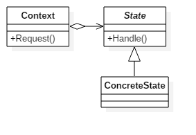

#### 定义

当一个对象内在状态改变时允许其改变行为，这个对象看起来像改变了其类。

#### 类图



**`State` 抽象状态角色**

接口或抽象类，负责对象状态定义，并且封装环境角色以实现状态切换。

**`ConcreteState` 具体状态角色**

每一个具体状态必须完成两个职责：本状态的行为管理以及趋向状态处理，通俗地说，就是本状态下要做的事情，以及本状态如何过渡到其他状态。

**`Context` 环境角色**

定义客户端需要的接口，并且负责具体状态的切换。

#### 实现

抽象状态角色：
```java
package com.sigalhu.statepattern.impl;

public abstract class State {
    //定义一个环境角色，提供子类访问
    protected Context context;

    //设置环境角色
    public void setContext(Context context){
        this.context = context;
    }

    //行为1
    public abstract void handle1();
    //行为2
    public abstract void handle2();
}
```
具体状态角色：
```java
package com.sigalhu.statepattern.impl;

public class ConcreteState1 extends State {
    @Override
    public void handle1() {
        //本状态下必须处理的逻辑
    }

    @Override
    public void handle2() {
        //设置当前状态为state2
        super.context.setCurrentState(Context.STATE2);
        //过渡到state2状态，由Context实现
        super.context.handle2();
    }
}
```
```java
package com.sigalhu.statepattern.impl;

public class ConcreteState2 extends State {
    @Override
    public void handle1() {
        //设置当前状态为state1
        super.context.setCurrentState(Context.STATE1);
        //过渡到state1状态，由Context实现
        super.context.handle1();
    }

    @Override
    public void handle2() {
        //本状态下必须处理的逻辑
    }
}
```
环境角色：
```java
package com.sigalhu.statepattern.impl;

public class Context {
    //定义状态
    public final static State STATE1 = new ConcreteState1();
    public final static State STATE2 = new ConcreteState2();

    //当前状态
    private State currentState;

    //获得当前状态
    public State getCurrentState(){
        return currentState;
    }

    //设置当前状态
    public void setCurrentState(State currentState) {
        this.currentState = currentState;
        //切换状态
        this.currentState.setContext(this);
    }

    //行为委托
    public void handle1(){
        this.currentState.handle1();
    }
    public void handle2(){
        this.currentState.handle2();
    }
}
```
场景类：
```java
package com.sigalhu.statepattern.impl;

public class Client {
    public static void main(String[] args){
        //定义环境角色
        Context context = new Context();
        //初始化状态
        context.setCurrentState(new ConcreteState1());
        //行为执行
        context.handle1();
        context.handle2();
    }
}
```

#### 优点

* 结构清晰。避免了过多的`switch...case`或者`if...else`语句的使用，避免了程序的复杂性，提高系统的可维护性；
* 遵循设计原则。很好地体现了开闭原则和单一职责原则，每个状态都是一个子类，你要增加状态就要增加子类，你要修改状态，就只要修改一个子类就好了；
* 封装性非常好。状态变换放置到类的内部来实现，外部的调用不用知道类内部如何实现状态和行为的变换。

#### 缺点

如果完全使用状态模式就会有太多的子类，造成类膨胀，不好管理。

#### 注意

状态模式适用于当某个对象在它的状态发生改变时，它的行为也随着发生比较大的变化，也就是说在行为受状态约束的情况下可以使用状态模式，而且使用时对象的状态最好不要超过5个。